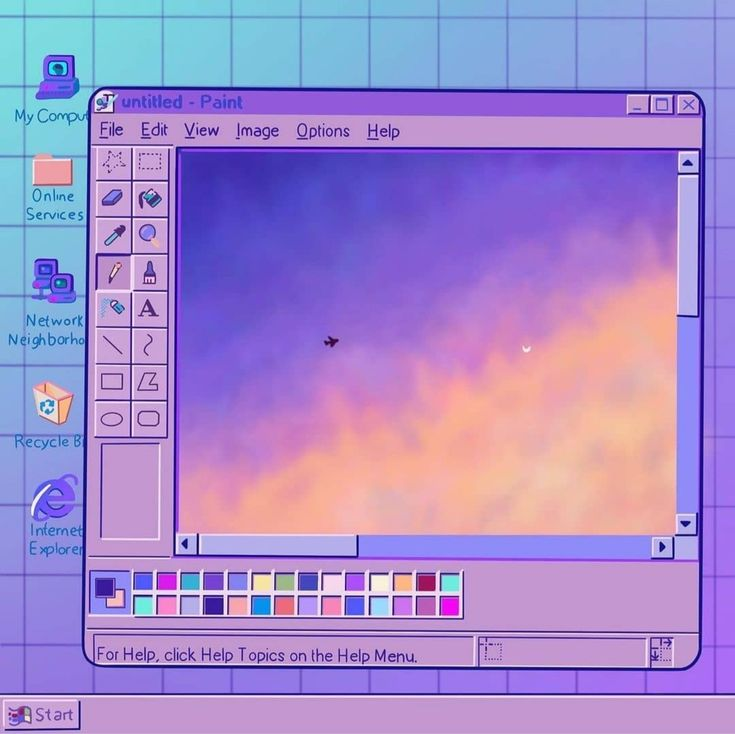

## Hey there! 

### About me ✨
I'm **EclypseSolaire** *or* **eclyline** (but you can call me "Damian" - it's my name).  
**15 (soon to be 16) years old**, high school student. 🔭
I enjoy **coding** from time to time (I don't really have time at the moment tho).  
I like **computers** and IT in general (studying **numerics and informatic science** & **engineering science** in high school).

I already coded in **Java, Python, and HTML/CSS (only a bit of these two)**.

I use the marriage of **macOS and coding**. 👯

#### Languages

#### Software

<!--
**eclypsesolaire/eclypsesolaire** is a ✨ _special_ ✨ repository because its `README.md` (this file) appears on your GitHub profile.

Here are some ideas to get you started:

- 🔭 I’m currently working on ...
- 🌱 I’m currently learning ...
- 👯 I’m looking to collaborate on ...
- 🤔 I’m looking for help with ...
- 💬 Ask me about ...
- 📫 How to reach me: ...
- 😄 Pronouns: ...
- ⚡ Fun fact: ...
-->